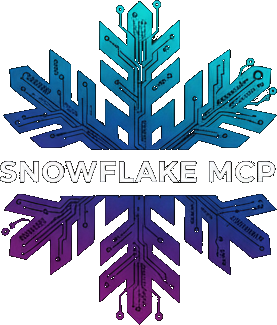

<div align="center">
  <br />
  
  <br />
  <br />

  <h1 align="center">Snowflake MCP Server</h1>

  <p align="center">
    <strong>Secure, read-only access to Snowflake with AI-powered query assistance</strong>
  </p>

  <p align="center">
    <a href="https://github.com/ncejda-g2/snowflake_mcp_server/releases">
      
    </a>
    <a href="./CHANGELOG.md">
      
    </a>
    <a href="https://modelcontextprotocol.io">
      
    </a>
  </p>

  <p align="center">
    <a href="#-features">Features</a> •
    <a href="#-quick-start">Quick Start</a> •
    <a href="#-installation">Installation</a> •
    <a href="#-usage">Usage</a> •
    <a href="./docs">Documentation</a>
  </p>
</div>

<br />

---

## What is Snowflake MCP?

Snowflake MCP Server bridges the gap between your Snowflake data warehouse and AI assistants like Claude. It provides a secure, **read-only** interface that lets AI help you explore schemas, write queries, and analyze data—all while maintaining enterprise-grade security through SSO authentication.

<details>
<summary><b>Demo</b></summary>

<div align="center">
  <br />
  
  <br />
  <br />
</div>

</details>

## Features

- 🔒 **Strict Read-Only Access**: Multiple layers of protection against write operations
- 🔑 **External Browser Authentication**: Uses Snowflake's secure browser-based SSO
- 💾 **Smart Caching**: 5-day schema cache for fast metadata access, reducing generic Snowflake schema queries and credit usage
- 📄 **CSV Export**: Export query results directly to CSV files
- 🛡️ **Query Validation**: Comprehensive SQL validation before execution
- 🎯 **Responsible Token Management**: Lightweight outputs to minimize token usage

## 🚀 Quick Start

```bash
# Clone the repository
git clone git@github.com:ncejda-g2/snowflake_mcp_server.git
cd snowflake_mcp_server

# Create and activate virtual environment
python3 -m venv snowflake_mcp_env
source snowflake_mcp_env/bin/activate  # On Windows: snowflake_mcp_env\Scripts\activate

# Install dependencies
pip install -r requirements.txt
```


## Configuration

<details>
<summary><b>Claude Code</b></summary>

Edit your `~/.claude.json` file:

```json
{
  "mcpServers": {
    "snowflake-readonly": {
      "command": "/path/to/snowflake_mcp_server/snowflake_mcp_env/bin/python",
      "args": ["/path/to/snowflake_mcp_server/main.py"],
      "env": {
        "SNOWFLAKE_ACCOUNT": "your-account",
        "SNOWFLAKE_USERNAME": "your-email@company.com",
        "SNOWFLAKE_WAREHOUSE": "YOUR_WAREHOUSE"
      }
    }
  }
}
```

Replace:
- `/path/to/snowflake_mcp_server`: Absolute path to your cloned repository
- `your-account`: Your Snowflake account identifier (e.g., `xy12345.us-east-1`)
- `your-email@company.com`: Your Snowflake username
- `YOUR_WAREHOUSE`: Your Snowflake warehouse name

</details>

<details>
<summary><b>Claude Desktop</b></summary>

Edit your configuration file:
- macOS: `~/Library/Application Support/Claude/claude_desktop_config.json`
- Windows: `%APPDATA%\Claude\claude_desktop_config.json`
- Linux: `~/.config/claude/claude_desktop_config.json`

```json
{
  "mcpServers": {
    "snowflake-readonly": {
      "command": "/path/to/snowflake_mcp_server/snowflake_mcp_env/bin/python",
      "args": ["/path/to/snowflake_mcp_server/main.py"],
      "env": {
        "SNOWFLAKE_ACCOUNT": "your-account",
        "SNOWFLAKE_USERNAME": "your-email@company.com",
        "SNOWFLAKE_WAREHOUSE": "YOUR_WAREHOUSE"
      }
    }
  }
}
```

Replace:
- `/path/to/snowflake_mcp_server`: Absolute path to your cloned repository
- `your-account`: Your Snowflake account identifier (e.g., `xy12345.us-east-1`)
- `your-email@company.com`: Your Snowflake username
- `YOUR_WAREHOUSE`: Your Snowflake warehouse name

</details>

<details>
<summary><b>Cursor</b></summary>

Edit your Cursor settings:

```json
{
  "mcpServers": {
    "snowflake-readonly": {
      "command": "/path/to/snowflake_mcp_server/snowflake_mcp_env/bin/python",
      "args": ["/path/to/snowflake_mcp_server/main.py"],
      "env": {
        "SNOWFLAKE_ACCOUNT": "your-account",
        "SNOWFLAKE_USERNAME": "your-email@company.com",
        "SNOWFLAKE_WAREHOUSE": "YOUR_WAREHOUSE"
      }
    }
  }
}
```

Replace:
- `/path/to/snowflake_mcp_server`: Absolute path to your cloned repository
- `your-account`: Your Snowflake account identifier (e.g., `xy12345.us-east-1`)
- `your-email@company.com`: Your Snowflake username
- `YOUR_WAREHOUSE`: Your Snowflake warehouse name

</details>

<details>
<summary><b>Gemini CLI</b></summary>

Edit your `~/.gemini/settings.json` file:

```json
{
  "mcpServers": {
    "snowflake-readonly": {
      "command": "/path/to/snowflake_mcp_server/snowflake_mcp_env/bin/python",
      "args": ["/path/to/snowflake_mcp_server/main.py"],
      "env": {
        "SNOWFLAKE_ACCOUNT": "your-account",
        "SNOWFLAKE_USERNAME": "your-email@company.com",
        "SNOWFLAKE_WAREHOUSE": "YOUR_WAREHOUSE"
      }
    }
  }
}
```

Replace:
- `/path/to/snowflake_mcp_server`: Absolute path to your cloned repository
- `your-account`: Your Snowflake account identifier (e.g., `xy12345.us-east-1`)
- `your-email@company.com`: Your Snowflake username
- `YOUR_WAREHOUSE`: Your Snowflake warehouse name

</details>

## Available Commands

The server provides powerful tools for interacting with Snowflake:

| Tool | Description |
|------|-------------|
| `refresh_catalog` | Scan and cache all database schemas |
| `inspect_schemas` | Browse database structure |
| `search_tables` | Search across all databases |
| `get_table_schema` | View table columns & sample data |
| `execute_query` | Run read-only SQL queries |
| `execute_big_query_to_disk` | Stream large results to CSV |
| `save_last_query_to_csv` | Export query results |


## 📚 Documentation

- [Changelog](./CHANGELOG.md) - Version history and updates


---

<div align="center">
  <p>
    <strong>Built with ❄️ for the AI + Data community</strong>
  </p>
  <p>
    <a href="https://github.com/ncejda-g2/snowflake_mcp_server/issues">Report Bug</a> •
    <a href="https://github.com/ncejda-g2/snowflake_mcp_server/issues">Request Feature</a>
  </p>
</div>
